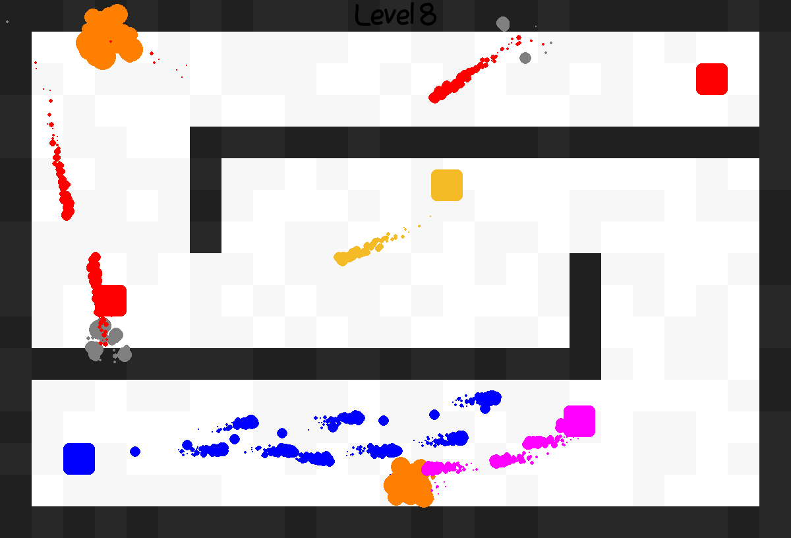

# Tank Game

A tank game made with python.



## Install Dependencies

Install the necessary dependencies.

```text
pip install -r requirements.txt
```

## Notes

W, A, S, and D are used to move around.

Hold the left mouse button to shoot.
